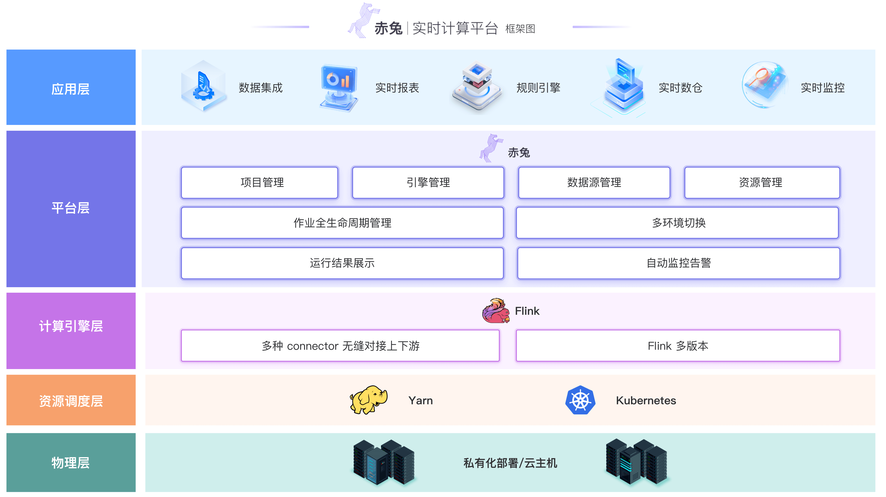
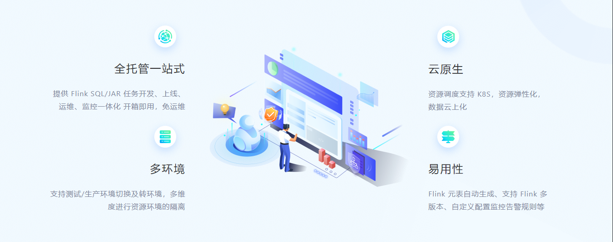

    <a href="https://galaxy-data-cn.github.io/chitu-sdp-website/">产品官网</a> | 
    <a href="https://183.57.45.188/#/login">体验环境</a> 

---

## 产品简介
#### 概述
[赤兔实时计算平台](https://galaxy-data-cn.github.io/chitu-sdp-website/)是跨越集团大数据生态体系的重要基石，具备开箱即用、一站式开发、亚秒级延时、统一 SQL 语言、端到端一致性、丰富的上下游支持、安全稳定等特点的企业级实时大数据计算平台。 赤兔平台提供 SQL 化的 IDE 开发环境，UI 化的任务发布及任务监控体系，支持多环境隔离及环境切换，可帮助企业快速实现实时应用开发与落地，加速企业面向实时数字化的建设进程。

#### 产品架构

#### 功能特性

## 快速开始

* [Flink SQL 作业快速入门](docs/md/FlinkSQL作业快速入门.md)
* [Flink DS 作业快速入门](docs/md/FlinkDataStream作业快速入门.md)

## 环境搭建部署

* [开发环境搭建](docs/md/本地运行.md)

* [Linux 环境部署](docs/md/平台部署.md)

* [Docker 环境部署](docs/md/docker部署.md)

## 获取帮助

* [操作指南](docs/md/docker部署.md)

* 扫码添加星河小助手，进入赤兔开源社区交流群

## 联系我们
| 姓名  | 邮箱        |职责        |
|-----|-----------|-----------|
| 商渭清  | sang.williams@gmail.com | PMC Chair |
| 唐安律 | lvvhebe@163.com | PMC Vice Chair |
| 刘斌  | sunnykaka0721@gmail.com | PMC Vice Chair |

