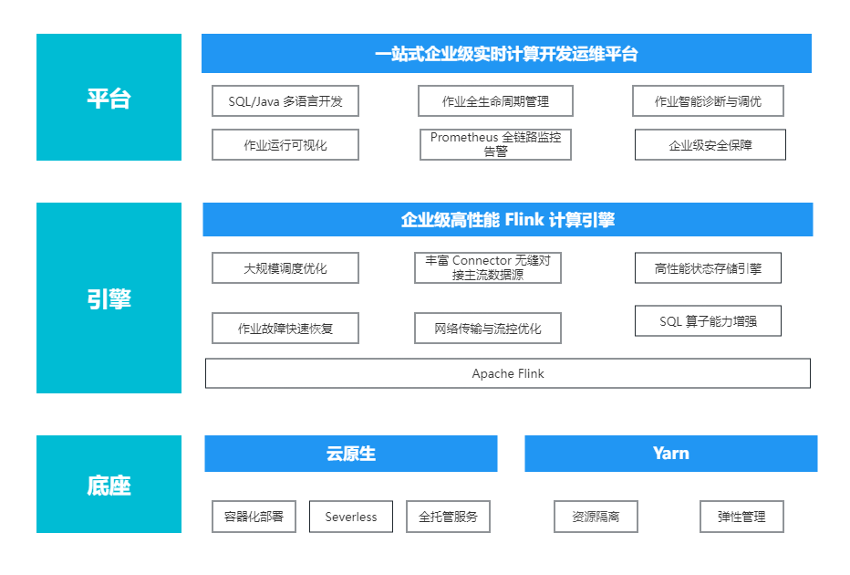
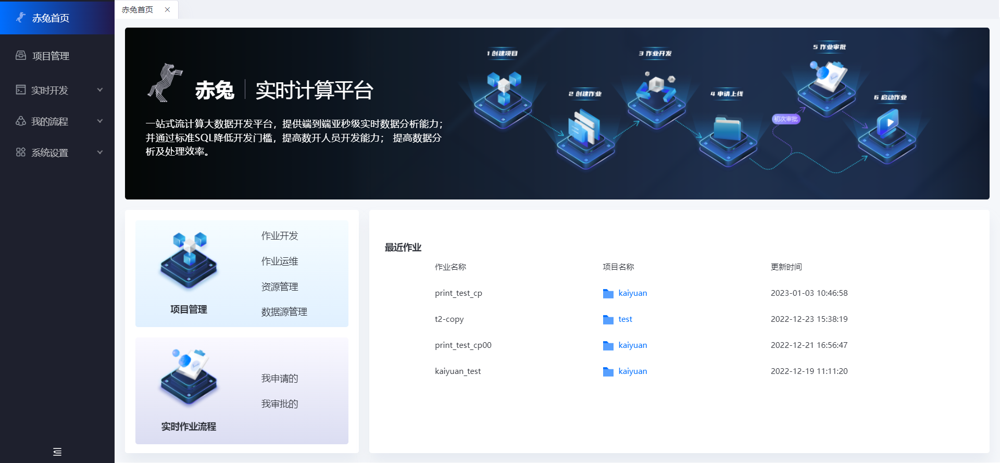
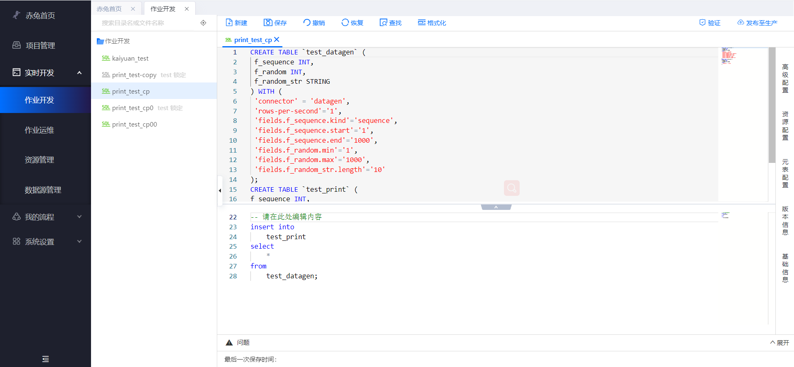

# 赤兔实时计算平台(chitu-sdp)
> 企业级一站式实时计算平台
### 项目简介
#### 概述
赤兔实时计算平台是大数据产品生态体系的实时化分析利器，是基于 Apache Flink 构建的具备一站开发、无缝连接、亚秒延时、低廉成本、安全稳定等特点的企业级实时大数据分析平台。赤兔实时计算平台以实现企业数据价值最大化为目标，加速企业实时化数字化的建设进程。
并通过标准SQL降低开发门槛， 提高数开人员开发能力，提高数据分析及处理效率。

#### 产品架构

#### 功能特性

* Apache Flink 开发脚手架
* 提供了一系列开箱即用的 Connectors
* 一站式的流任务管理平台
* 支持测试环境, 生产环境等多环境切换
* 支持 Flink 多版本
* 支持 Yarn/K8s 多集群部署
* 支持作业从指定的消费位置(latest-offset、earliest-offset、group-offset以及timestamp)启动
* 支持作业从检查点和保存点恢复
* 支持 Flink SQL 和 Flink DataStream 任务运行
* 支持 UDF/UDTF 管理与引用
* 支持作业上线审批、作业运维、作业监控以及预警发送
* 支持多数据源管理功能
* 支持作业多版本比较
* ...

  

  
### 环境搭建部署
* [开发环境搭建](docs/md/本地运行.md)
* [Linux 环境部署](docs/md/平台部署.md)
* [容器化部署](docs/md/docker部署.md)

### 快速入门
* [Flink SQL作业快速入门](docs/md/FlinkSQL作业快速入门.md)
* [Flink DS作业快速入门](docs/md/FlinkDataStream作业快速入门.md)

### 操作指南
[操作指南](docs/md/操作指南.md)

### 特别鸣谢

感谢唐安律先生在项目产品设计、技术实现方案中给与的指导和帮助！

