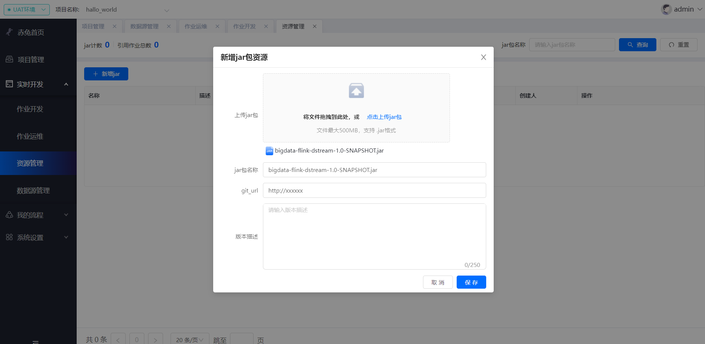
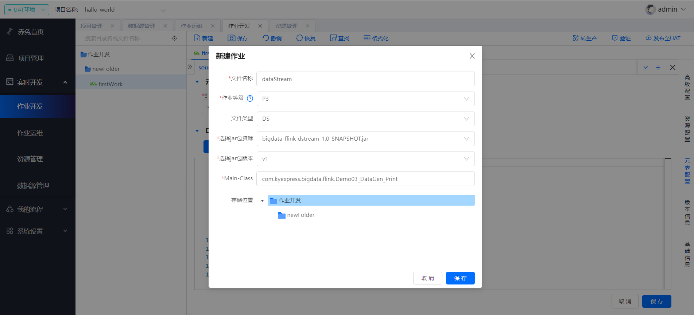
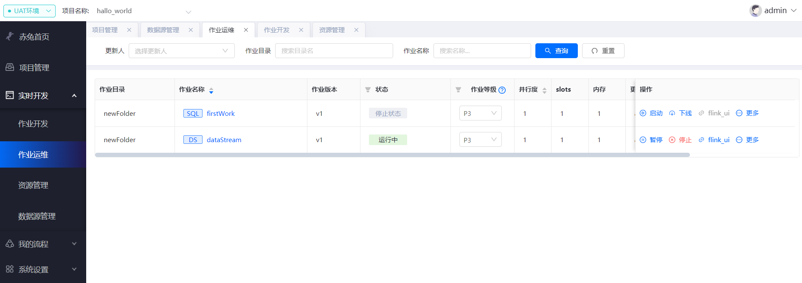
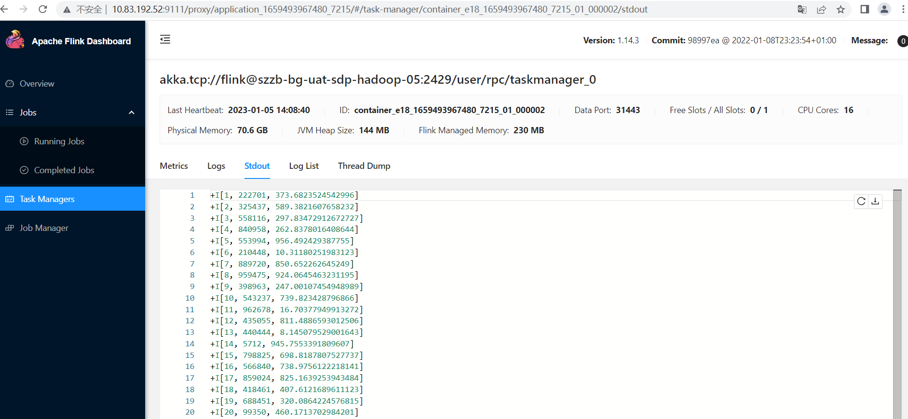

## Flink DataStream流作业快速入门
### 前置条件
这里需要先创建集群配置、创建项目、创建数据源，可参考Flink SQL快速入门。

### 作业开发
首先先写dataStream流作业，写完后打jar包上传，这里以datagen输出到print控制台为例
```
import org.apache.flink.api.java.utils.ParameterTool;
import org.apache.flink.configuration.PipelineOptions;
import org.apache.flink.streaming.api.environment.StreamExecutionEnvironment;
import org.apache.flink.table.api.bridge.java.StreamTableEnvironment;

public class Demo03_DataGen_Print {

    public static void main(String[] args) {
    
        //通过该方式获取配置文件定义的main参数
        ParameterTool parameterTool = ParameterTool.fromArgs(args);
        parameterTool.toMap().forEach((k, v) -> {
            //  System.out.println(k + ":" + v);
        });
        String jobName = parameterTool.get("main.param.pipeline.name","Demo03_DataGen_Print");
        System.out.println("jobName = " + jobName);
        StreamExecutionEnvironment env = StreamExecutionEnvironment.getExecutionEnvironment();
        StreamTableEnvironment tableEnv = StreamTableEnvironment.create(env);
        env.setParallelism(1);
        tableEnv.getConfig().getConfiguration().setString(PipelineOptions.NAME,jobName);
        
        String orderSql="CREATE TABLE order_info (\n" +
            "    id INT,\n" +        "    user_id BIGINT,\n" +
            "    total_amount DOUBLE,\n" +
            "    create_time AS localtimestamp,\n" +
            "    WATERMARK FOR create_time AS create_time\n" +
            ") WITH (\n" +
                "    'connector' = 'datagen',\n" +
                "    'rows-per-second'='1',\n" +
                "    'fields.id.kind'='sequence',\n" +
                "    'fields.id.start'='1',\n" +
                "    'fields.id.end'='1000000',\n" +
                "    'fields.user_id.kind'='random',\n" +
                "    'fields.user_id.min'='1',\n" +
                "    'fields.user_id.max'='1000000',\n" +
                "    'fields.total_amount.kind'='random',\n" +
                "    'fields.total_amount.min'='1',\n" +
                "    'fields.total_amount.max'='1000'\n" +
                ")";
                
        String sinkSql="CREATE TABLE sink_order_info (\n" +
            "    id INT,\n" +        "    user_id BIGINT,\n" +
            "    total_amount DOUBLE,\n" +
            "    create_time AS localtimestamp,\n" +
            "    WATERMARK FOR create_time AS create_time\n" +
            ") WITH (\n" +
            "    'connector' = 'print'\n" +
            ")";
         
        tableEnv.executeSql(orderSql);
        tableEnv.executeSql(sinkSql);
        tableEnv.executeSql("insert into sink_order_info select id,user_id,total_amount from order_info");
        
     }
 }

```
选择**实时开发**菜单中的**资源管理**，上传打包好的作业jar包。


然后在作业开发中选择DS文件类型的作业，选择上传的jar包资源及版本，然后发布至UAT。



启动后可以看到作业在**运行中**的状态，flink流作业就启动起来了，可点击右侧**flink_ui**中查看运行状态。


