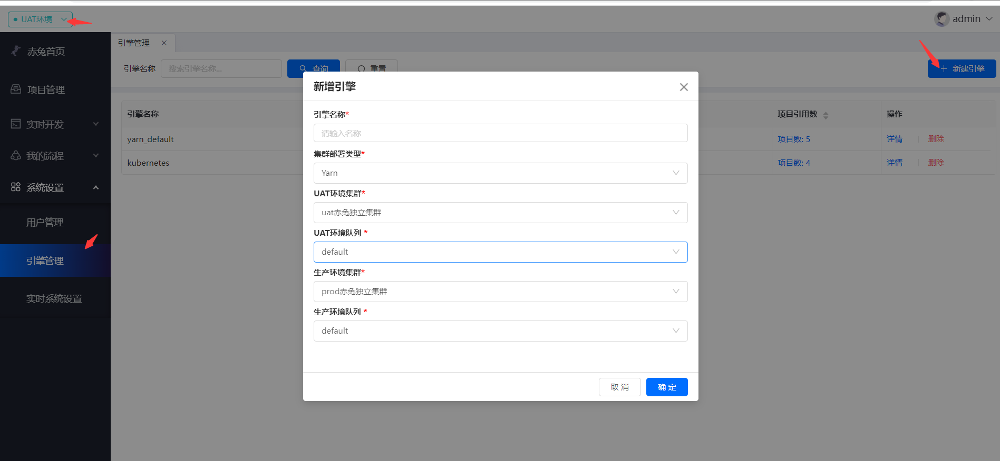
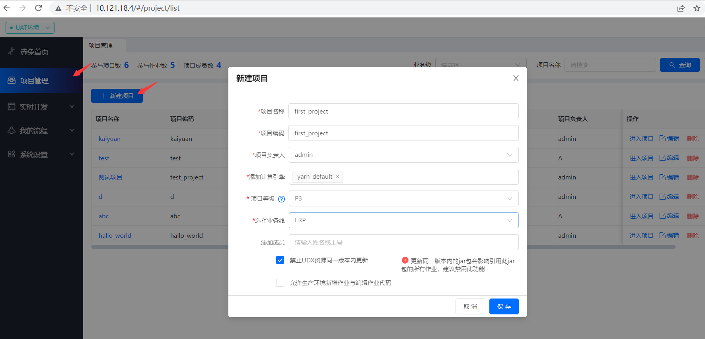
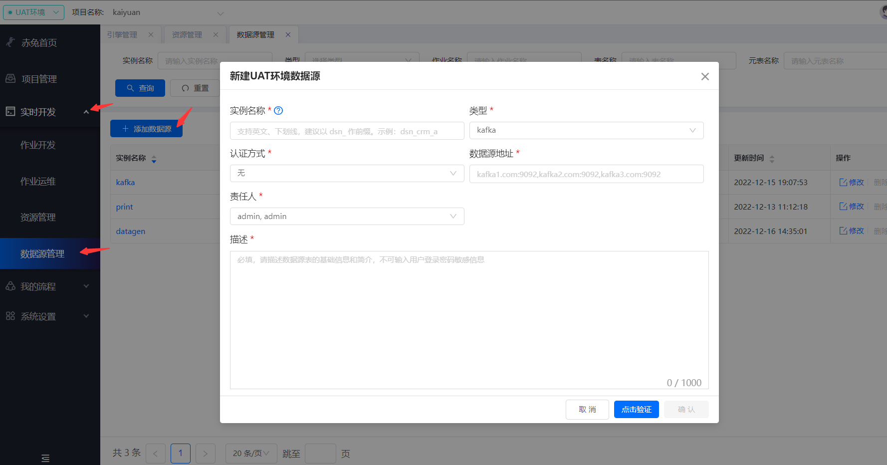
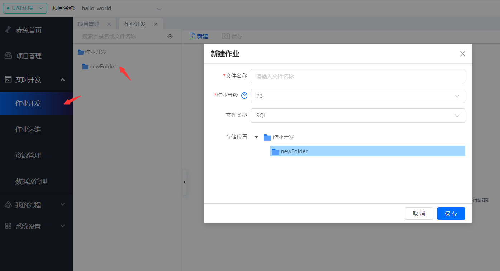
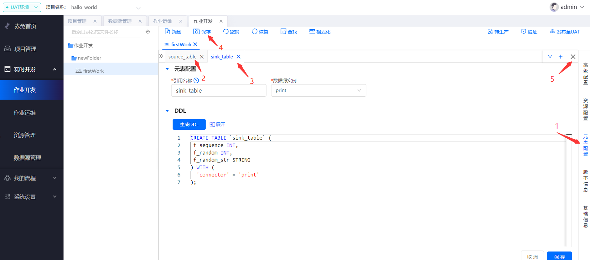
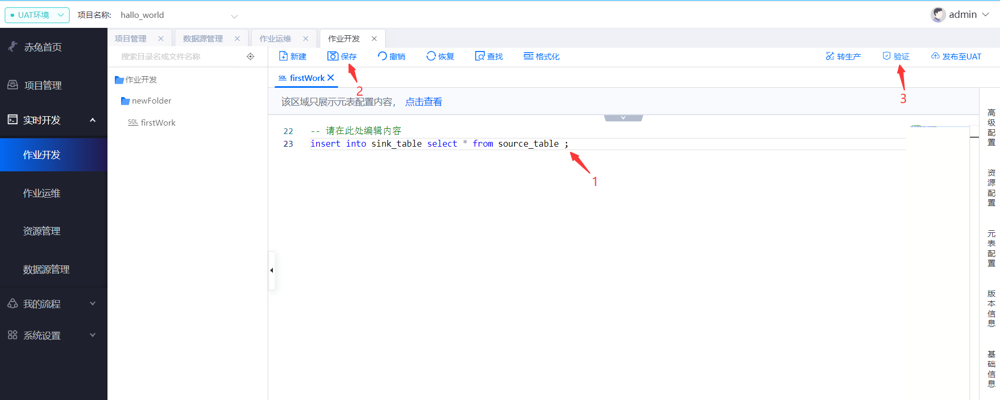
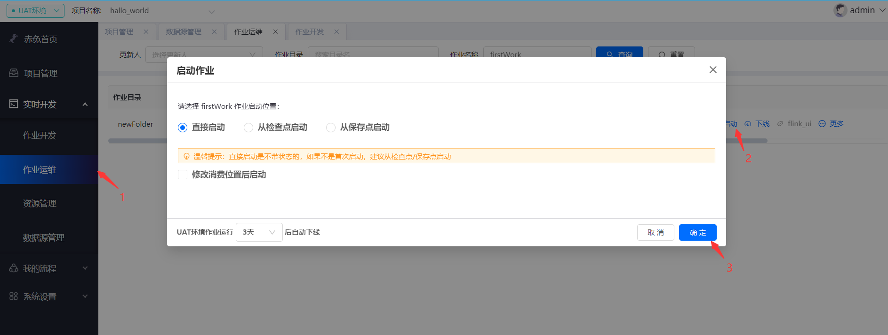
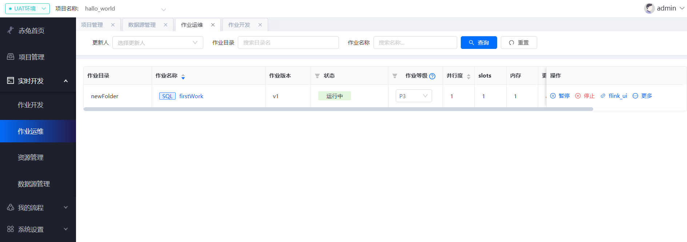
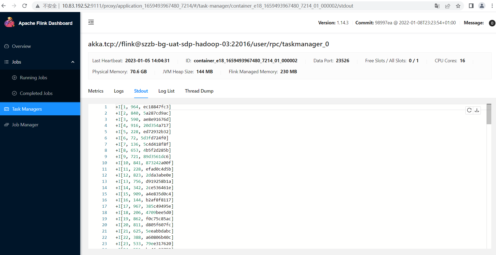

## Flink SQL快速入门
### 创建集群配置
首先先在配置文件配置相关集群配置，以flink on yarn为例
```
yarn:
    envMap:
        uat: #UAT环境
            defaultConfig:
                queue: sdp_flink #yarn队列
                container:
                    minVcores: 1 #容器最小核数
                    minMem: 2 #容器最小内存，单位G
            clusterSyncLocalDir: /app/bigdata-sdp/  #存放jar等相关资源本地路径
            clusters:
            - clusterName: uat赤兔独立集群 #集群名称
              clusterCode: one_ticket_cluster #集群code
              nameServices: hdfs://bigbigworld
              flinkClient114Url: http://10.121.18.1:12228 #submit项目部署节点
              flinkClient115Url: http://10.121.18.1:12229 #submit项目部署节点
              hadoopConfDir: /opt/apache/hadoop-one-ticket/etc/hadoop
              flinkProxyUrl:
              flinkHistoryUrl:
        prod: #生产环境
            defaultConfig:
            queue: sdp_flink
            container:
                minVcores: 1 #容器最小核数
                minMem: 2 #容器最小内存，单位G
            clusterSyncLocalDir: /app/bigdata-sdp/
            clusters:
            - clusterName: prod赤兔独立集群
              clusterCode: one_ticket_cluster
              nameServices: hdfs://bigbigworld
              flinkClient114Url: http://10.121.18.1:12228
              flinkClient115Url: http://10.121.18.1:12229
              hadoopConfDir: /opt/apache/hadoop-one-ticket/etc/hadoop
              flinkProxyUrl:
              flinkHistoryUrl:


```
配置完之后在页面功能上做相应的配置，先选择**环境**再选择**引擎管理**点击**新建引擎**即可创建引擎


### 创建项目
在项目管理中新建项目即可



### 添加数据源
在**实时开发**里的**数据源管理**进行**添加数据源**，这里可以先添加datagen、print，后续可运行一个简单的datagen数据源输出到print


### 作业开发
在**实时开发**里的**作业开发**鼠标移动到文件夹新建作业，文件类型选择sql


新建完成后双击作业进入编辑，这里以datagen输出到控制台print为例

1、点击**元表配置**新增flink表。

2、新增source表，数据源实例选择datagen，然后点击生成DDL选择要保留的字段

3、新增sink表，同样的创建print表。

4、点击保存。

5、编辑元表信息完后关闭窗口。


创建元表后就可以写sql做逻辑处理了，编写sql后点击保存然后点击验证可以验证其语法正确性，在验证完后就可以**发布至UAT**环境或者**转生产**(等效于在生产环境复制一份作业)。


在发布完UAT环境之后，在**作业运维**中可以看到发布的作业，刚上线的作业为初始状态，点击启动进行启动作业，可以直接启动，也可以从检查点/保存点启动，这里选择直接启动。


启动后可以看到作业在**运行中**的状态，可以点击右侧**flink_ui**查看flink运行情况，至此一个简单的作业就启动起来了。




